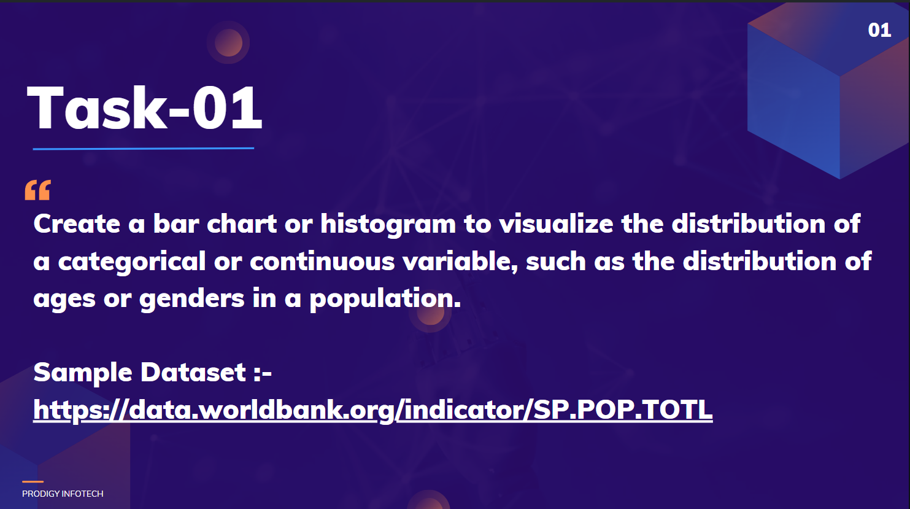

# Prodigy InfoTech Data Science Internship Task-01
 

### Welcome to Task 1 Submission!
This is my submission for Task 1 of the Data Science Internship at Prodigy Infotech. In this task, I analyzed the dataset provided and created a chart to show the distribution of a variable, such as age or gender. The project uses Python for data analysis and visualization.

# Task-01: Data Visualization with Bar Chart or Histogram

## Objective
To create a bar chart or histogram to visualize the distribution of a categorical or continuous variable, such as ages or genders in a population, using a sample dataset.

## Sample Dataset
[World Bank Population Dataset] This dataset contains records of population from the year 2001 to 2022.

## Deliverables
- A visualization (bar chart or histogram) representing the distribution of the selected variable.
- Clear labels, legends, and appropriate styling for better interpretability.

## Tech Stack
- **Language**: Python
- **Libraries**: Matplotlib, Seaborn, Pandas, Numpy

## Organization:
- **Prodigy Infotech**
